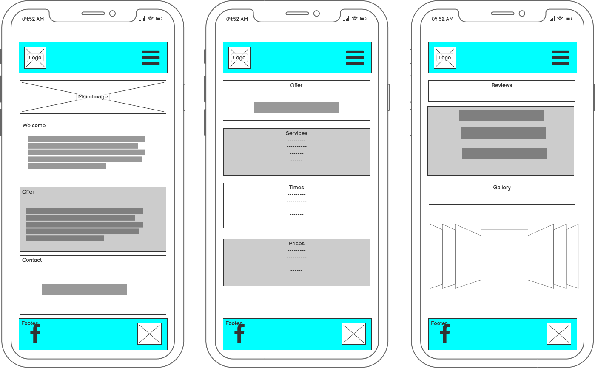
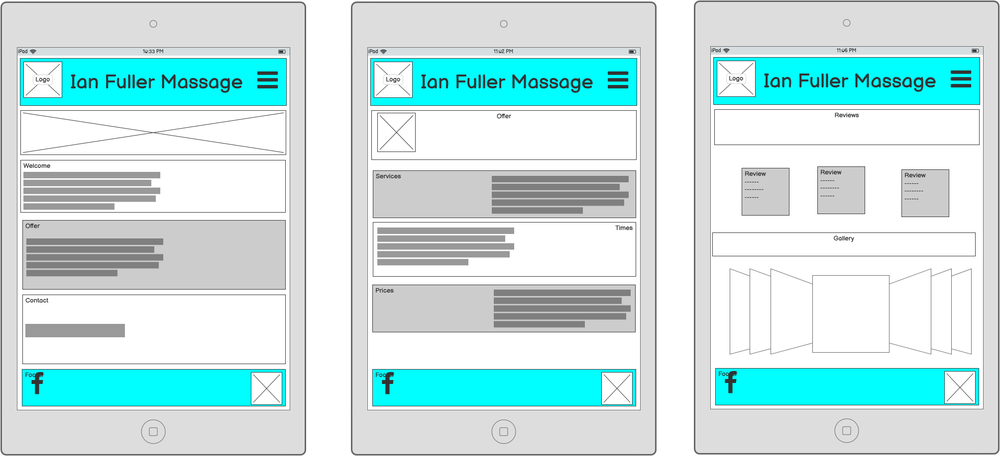
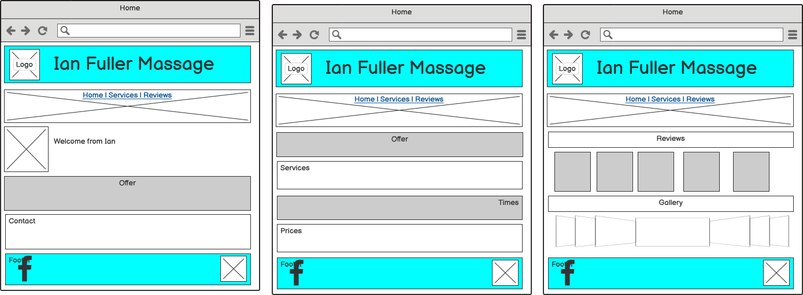

# Portfolio Project 1 - Cheryl Phillips - "Ian Fuller Massage"

## Concept

Ian Fuller Massage is a new business startup providing sports massage therapy services. This website aims to promote Ian Fuller Massage to new clients, as well as inform existing clients of offers and provide a means of contact for booking appointments. . 

### User Stories

Visitors to the site should be able to:
* Load it on a mobile, tablet or desktop
* Navigate between the pages easily
* Find out about the services offered by Ian
* Find the prices of each service
* Contact Ian

### Features of the site

* A consistent header and footer throughout the site, wether viewed on a mobile, tablet or desktop. 
* A welcome from Ian.
* For mobile and tablet views, a collapsible menu to save on screen space.
* Consistent corporate theme - colours used for Ians logo and facebook page are : #24d9f1 and #4d4c4f
* Link to social media. 
* A gallery of recent events.
* A contact form.
* Professional accreditations on display. 

### Wireframes

[Link to Balsamiq files](./assets/images/wireframes/ian_fuller_massage.bmpr)

#### Mobile View
Designed with a collapsible menu for space saving on small screens. Header and footer will be consistent throughout all pages to maintain a uniform corporate image. Colours blue, grey and white match Ian's logo, printed media, and social media pages. 

#### Tablet View
Designed with a collapsible menu for space saving still although a larger screen than mobile, space is still at a premium users may be browsing portrait rather than landscape. Header and footer design will follow the same theme as mobile but will utilise the extra space to display the business name in the header. Colours will be consistent with corporate image. 

#### Desktop View
This design features a full header with a nav bar and main title image on the page. The nav bar will be sticky and follow the user down the page. The footer will remain the same design as the mobile and tablet layout. Colours will be consistent with corportage image. 

---

## Project Development

---

## Testing

---

## Deployment

---

## Credits