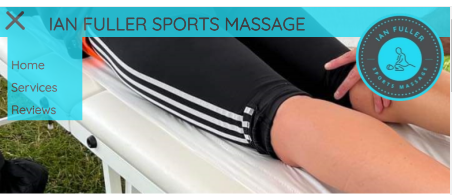
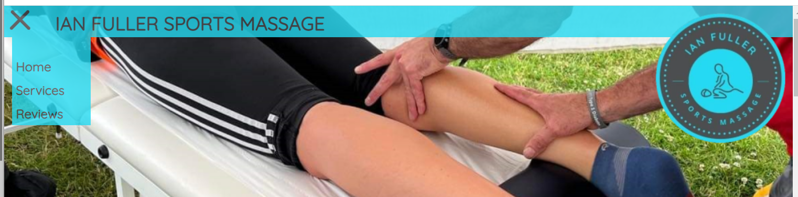

# Portfolio Project 1 - Cheryl Phillips - "Ian Fuller Sports Massage"

## Concept

Ian Fuller Sports Massage is a new business startup providing sports massage therapy services. This website aims to promote Ian Fuller Sports Massage to new clients, as well as inform existing clients of offers and provide a means of contact for booking appointments.

### User Stories

Visitors to the site should be able to:
* Load it on a mobile, tablet or desktop
* Navigate between the pages easily
* Find out about the services offered by Ian
* Find the prices of each service
* Contact Ian

### Features of the site

* A consistent header and footer throughout the site, wether viewed on a mobile, tablet or desktop. 
* A welcome from Ian.
* For mobile and tablet views, a collapsible menu to save on screen space.
* Consistent corporate theme - colours used for Ians logo and facebook page are : `#24d9f1` and `#4d4c4f`
* Link to social media. 
* A gallery of recent events.
* A contact form.
* Professional accreditations on display. 

### Wireframes

[Link to Balsamiq files](documentation/wireframes/ian_fuller_massage.bmpr)

#### Mobile View
Designed with a collapsible menu for space saving on small screens. Header and footer will be consistent throughout all pages to maintain a uniform corporate image. Colours blue, grey and white match Ian's logo, printed media, and social media pages. 


#### Tablet View
Designed with a collapsible menu for space saving still although a larger screen than mobile, space is still at a premium users may be browsing portrait rather than landscape. Header and footer design will follow the same theme as mobile but will utilise the extra space to display the business name in the header. Colours will be consistent with corporate image. 


#### Desktop View
This design features a full header with a nav bar and main title image on the page. The nav bar will be sticky and follow the user down the page. The footer will remain the same design as the mobile and tablet layout. Colours will be consistent with corportage image. 


---

## Project Development

### Header Design

I started the project by developing the header as this will be mainly consistent across all pages. This has evolved slightly from the initial concept wireframe as visually the large block of blue at the top of the page as well as a banner image was redundant space on the site and didnt feel balanced. 

The final header design agreed on with the customer has a smaller top bar with the logo overlaying the banner image. 

**Mobile Header**


The mobile version of the site header and nav bar is viewed on devices 600px or less. This features responsive sizing for the ``<h1>`` element using ``vw`` as the unit of measurement. It displays a different png file for the banner image which is thinner to occupy less space on the screen and a smaller sized logo. The hamburger menu is used to ensure navigation does not occupy valuable screen space and detract from the site content. 

**Tablet Header**


The tablet version of the site header and nav bar is viewed on devices between 600px and 992px. This reverts to standard sizing for the ``<h1>`` element and uses a larger banner image to take advantage of a bigger screen size. The logo displayed is still the smaller version to account for the portrait viewing width. Hamburger nav menu is maintained for consistency and clean design. 

**Desktop Header**

The desktop version of the site header and nav bar is viewed on any screen wider than 992px. This takes advantage of the banner image in full and the original sized logo image. I have maintained the hamburger nav menu for consistency across the site and after viewing a range of websites with them in use on their desktop version it provides an uncluttered viewing area for the site content. 

### Technologies Used
* [Canva](www.canva.com) - Logo design and image manipulation
* Paint.net - Image manipulation and resizing
* Google Fonts - Quicksilver font used 

---

## Testing

---

## Deployment

---

## Credits

* [Device breakpoint media queries used from recommendation on W3Schools](https://www.w3schools.com/css/css_rwd_mediaqueries.asp

```/* Extra small devices (phones, 600px and down) */
@media only screen and (max-width: 600px) {...}

/* Small devices (portrait tablets and large phones, 600px and up) */
@media only screen and (min-width: 600px) {...}

/* Medium devices (landscape tablets, 768px and up) */
@media only screen and (min-width: 768px) {...}

/* Large devices (laptops/desktops, 992px and up) */
@media only screen and (min-width: 992px) {...}

/* Extra large devices (large laptops and desktops, 1200px and up) */
@media only screen and (min-width: 1200px) {...}
```

* [Hamburger menu code from Erik Terwan](https://codepen.io/erikterwan/pen/grOZxx)
HTML and CSS code used with CSS modifications made to fit site style and theme 