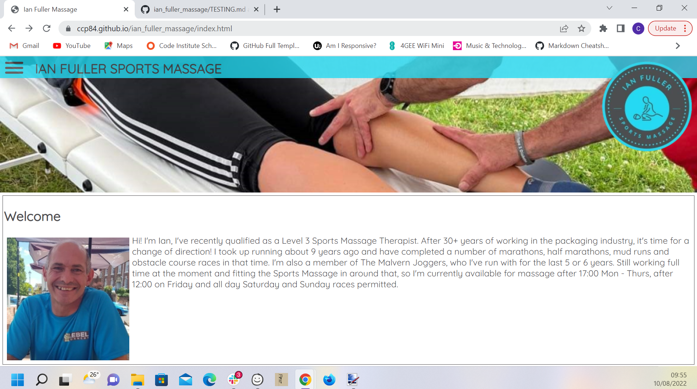

# Testing Documentation for Ian Fuller Sports Massage

## User Stories and Features

| Visitors to the site should be able to: |      |
| ----------------------------------------| --- |
| Load it on a mobile, tablet or desktop  | Media queries allow the site to be viewed efficiently at different window widths |
| Navigate between the pages easily       | A consistent menu allows site visitors to navigate between the pages |
| Find the prices of each service         | The prices are clearly visible, including offers from the servies and prices page. |
| Contact Ian                             | Contact details are visible from the bottom of the main page |

|Features of the site:                    |         |
| --------------------------------------- | --------|
| A consistent header and footer throughout the site, wether viewed on a mobile, tablet or desktop. | The header and footer, although having minor image file variations for best viewing on each type of device, have a consistent style and layout.  as you can see there is only limited variation from this to the mobile view .  again very little variation in the footer design  |
| A welcome from Ian                       | This is included on the main landing page to introduce visitors to the site.  |
| For mobile and tablet views, a collapsible menu to save on screen space | The hamburger menu was kept across all designs for site consistency and clean code design.  |
| Consistent corporate theme               | Use of the main colours and logo tie the site nicely together maintaining a consistent feel throughout the site.  |
| Link to social media                     | A link to the facebook page is included in the footer  |
| A gallery of recent events               | A gallery is included on the reviews page from Joust 24 hour race.  |
| A contact form                           | I have not implemented this feature due to the lack of either PHP or JavaScript functionality to make it work properly. As this site is to eventually be used commercially, it is a feature I will be working on following submission to complete the PHP functionality by reviewing learning from my previous degree course to get it working correctly for the customer. |
| Professional accreditations on display   | I have used the FHT logo in the footer of the page in accordance with the rules set out by their membership. This links to Ian's personal page within their site where clients can review his memership of the FHT and leave reviews directly on the site there.  |

## Code Validation

### W3C Validator

Initially the Reviews page threw up a duplicate classes error from applying two previously created classes to the same `<div>`.

```html
<div class="box2" class="div_pic">
```
```css
 /*Dark box*/
  .box2 {
    color: #24d9f1;
    background-color: #4d4c4f;
    border-style: solid;
    border-width: 1px;
    border-color: #24d9f1;
    margin: 5px;
    padding: 2px;
  }
  /*Use to center and constrain images inside the grid*/
  .div_pic {
    text-align: center;
  }
  ```
To rectify this, I created a new `box2_pic` class for use on the reviews page and applied this to the gallery. 

```css
 /*To box in gallery pictures*/
  .box2_pic {
    color: #24d9f1;
    background-color: #4d4c4f;
    border-style: solid;
    border-width: 1px;
    border-color: #24d9f1;
    margin: 5px;
    padding: 2px;
    text-align: center;
  }
  ```

  All 3 pages now pass through the W3C validator
  


  ### Jigsaw Validator

  The W3C CSS Jigsaw validation was passed with no errors and just 3 warnings on the code copied for the hamburger menu. 
  

## Responsiveness

**Full Screen**

Fullscreen views and links all tested as working for any size over 992px wide



**Tablet View**

Tablet view tested as working for any sizes between 600px and 992px wide


**Mobile View**

Mobile view tested for any width smaller than 600px wide tested both in a small browser window and on an iphone. 


## Accessibility (Lighthouse Score)

### Home Page

**Initial audit points :**
* Image elements do not have explicit `width` and `height`

For the *Current Offer* image, this is handled by the css class applied to make it responsive:
```css
.grid_pic {
    width: 100%;
    max-width: 600px;
  }
```
For the 3 footer images however I have fixed these with a `height` of 50px again in the css as the footer height does not change across the 3 views.

```css
.foot_pic {
  height: 50px;
}
```
* Form elements do not have associated labels

This is referring to the checkbox used in the external code for the hamburger menu. 
```html
<input type="checkbox" />
```
To resolve this I have labelled this checkbox up as acting as a navigation menu 
```html
<input id="navi" type="checkbox" />
<label for="navi">This checkbox is acting as a navigation menu</label>
```
 
 * Document does not have a meta description 

 I have now added this to the `<head>` of the page

**Final Lighthouse scores after bug fixes:**


### Services and Pricing Page

**Initial Audit Points**

* Image elements do not have explicit ``width`` and ``height``

As for the index page, I have applied a `height` of 50px by using the ``foot_pic`` class as the height of the footer element does not change. 

```css
.foot_pic {
  height: 50px;
}
```

* Form elements do not have associated labels

To resolve this I have used the same fix as for the home page with labelling of the checkbox in the navigation menu code. 
```html
<input id="navi" type="checkbox" />
<label for="navi">This checkbox is acting as a navigation menu</label>
```
* Document does not have a meta description

Meta description added to the `<head>` element of the page

**Final Lighthouse scores after bug fixes for services page**


### Reviews and Gallery Page

**Initial Audit Points**

* Image elements do not have explicit `width` and `height` 

Gallery images are handeled by the `grid_pic` class to make the responsive when wrapped in the `box2_pic` class:

```css
.grid_pic {
    width: 100%;
    max-width: 600px;
  }
```

The 3 footer images are again maintained at `50px` by the `foot_pic` class:

```css
.foot_pic {
  height: 50px;
}
```

* Form elements do not have associated labels

I have used the same `<label>` fix as on the other 2 pages to resolve this issue.

* Document does not have a meta description

I have added this to the `<head>` element of the document

**Final Lighthouse scores after bug fixes for reviews page**


## Browser Compatibility

To test cross platform compatibility as far as possible, the site has been tested as working in the following browsers:

* Google Chrome


* Firefox (Developer)


* Microsoft Edge


* Safari


[Return to README](../../README.md)